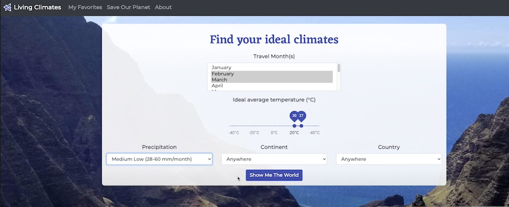
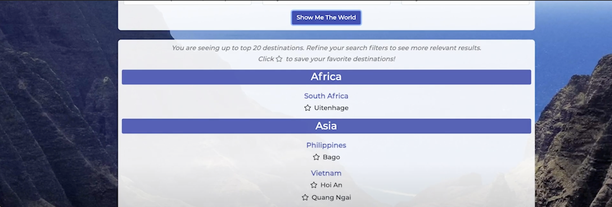
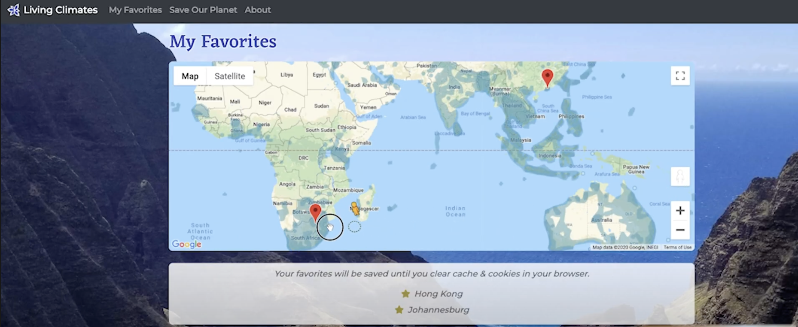
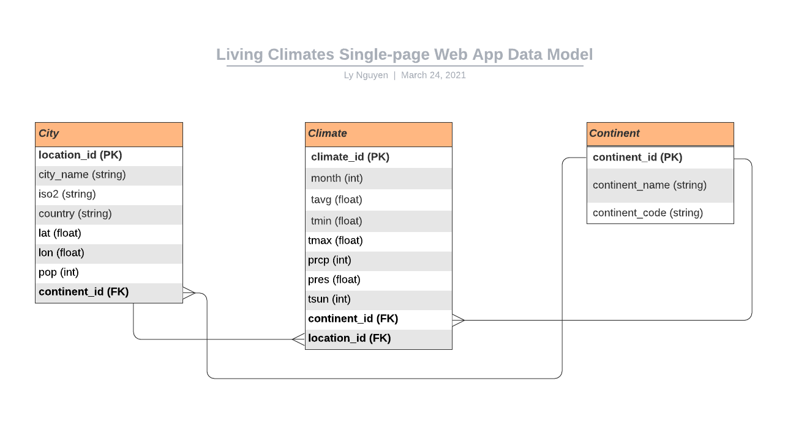

# Living Climates
#### Developed by: [Ly Nguyen](https://www.linkedin.com/in/lynguyen237/)
#### Click [here](https://www.youtube.com/watch?v=M7bOF64Q8Yw) to see the video presentation
<br>
Living Climates is a single-page web application that enables aspiring travelers to search for destinations around the world based on their preference for climates (temperature & precipitation) at a given time of the year. Users can refine their searches by adding filters for continent and/or country. They can then save their favorite destinations in the browser and view all of their locations on an interactive map powered by Google Maps API. As an added bonus, users can check out and support cool initiatives and causes that aim at preserving our beautiful planet.

### Table of Content (WIP)
1. [Main Screens](#main-screens)
    * [Explore Climates](#homepage)
    * [View Favorites](#favorites)
    * [Save Our Planet](#saveplanet)
2. [Backend - the Data Model](#backend)
    * [Process to populate Data](WIP)
3. [Techstack & APIs](#techstack)
4. [Installation](#installation)
5. [Contribution & License](#contribution)

### Main Screens <a name="main-screens"></a>
- **Explore Climates** <a name="homepage"></a>: search for travel destinations according to your travel time and preferred climates such as temperature (2-input slider) and precipitation level (dropdown). Users can narrow down the search with "Continent" and "Country" filter. Clicking on the “Search” button sends the parameters to the Flask route in the backend. The server queries the database using SQLAlchemy to find the cities that match your preferences. Users can star the cities to save them to their favorite list stored in a Flask session cookie for later review.



- **View favorite locations** <a name="favorites"></a>you have starred on a maps powered by Google Maps API. It's interactive so users can zoom in to see the physical location of the place.


- **Support environmental initiatives** <a name="saveplanet"></a>


### Backend - the Data Model <a name="backend"></a>
Here is my database that is implemented with PostgreSQL and Flask-SQLAlchemy (dependent on SQLAlchemy and psycopg2).


### Techstack & APIs <a name="techstack"></a>
- Techstack: Python, Flask, AJAX, JavaScript, React, PostgreSQL, SQLAlchemy, HTML, CSS
- APIs: [Meteostat API](https://meteostat.net/en), [Google Maps JavaScript API](https://developers.google.com/maps/documentation/javascript/overview)

### Installation <a name="installation"></a>
```
$ git clone https://github.com/Lynguyen237/LivingClimates-CapstoneProject
$ virtualenv env
$ source env/bin/activate
$ pip install -r requirements.txt
$ ...[WIP]
```

### Contribution & License <a name="contribution"></a>
Data are meant for non-commercial use and require prominent attribution. See the [About](http://34.216.240.129/about) page for details.
- **Climate Data**: based on long-term averages of historical weather observations over a 30-year period from 1960 to 1990. Source: Meteostat. Raw data provided by NOAA, DWD and others.
- **World Cities Data**: the list of ~26,000 cities and their longtitudes and lattitudes are retrieved from SimpleMaps.
- **Country and Continent Data**: retrieved from by DataHub.io and FreeFormatter.
- **Photography**: background image taken by my kind & talented friend Natalie Wong. Check out nat0graphy.com for more of her work.
